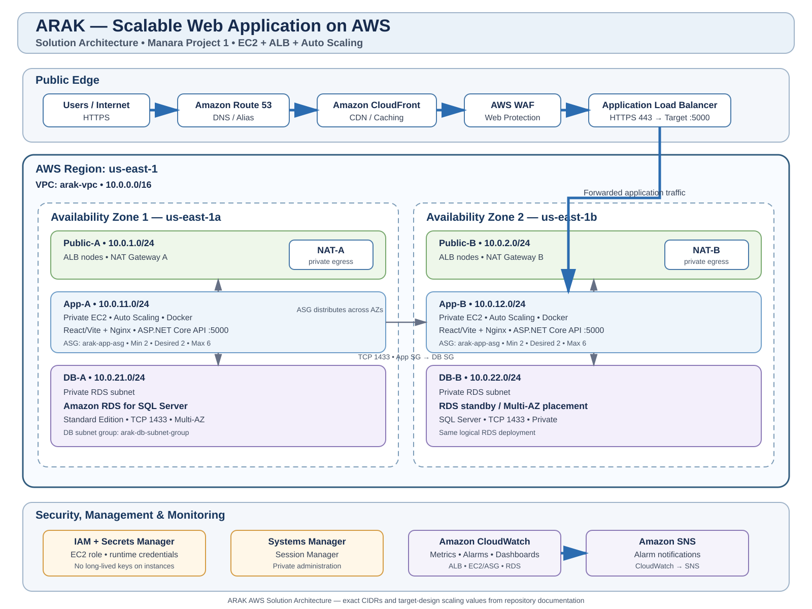

# Arak AWS Solutions Architect – Associate Project

AWS Solutions Architect – Associate graduation project based on the Arak education-management SaaS application.

## Project

**Manara Project 1 – Scalable Web Application with ALB and Auto Scaling**

This repository documents the complete AWS solution architecture for Arak and the practical AWS implementation evidence produced during the project. It covers architecture design, network segmentation, security, availability, scalability, observability, and operational access.

## Solution Architecture



**Original architecture diagram:** [view the previous diagram version](https://github.com/AhmedsaadyAS/arak-aws-saa-project/blob/8ae1ad017ba71700535d7df86e661373336e2aa8/ARCHITECTURE/diagrams/aws.jfif)

The architecture uses:

- Amazon Route 53 for DNS
- Amazon CloudFront for global delivery and static-content caching
- AWS WAF for web-layer protection
- Internet-facing Application Load Balancer for application traffic
- Amazon EC2 Auto Scaling across two Availability Zones
- Dockerized React/Vite + Nginx frontend and ASP.NET Core API
- Amazon RDS for SQL Server in private database subnets
- NAT Gateway for controlled private-subnet egress
- IAM roles, AWS Secrets Manager, and Systems Manager
- Amazon CloudWatch and Amazon SNS for monitoring and alerting

## Request Flow

```text
User
  |
  v
Route 53
  |
  v
CloudFront + WAF
  |
  v
Application Load Balancer
  |
  v
Target Group
  |
  v
EC2 Auto Scaling Group
  |
  +--> React/Vite + Nginx
  |
  +--> ASP.NET Core API :5000
             |
             v
       Amazon RDS for SQL Server :1433
```

CloudFront provides the public edge and caching layer in front of the Application Load Balancer. The ALB is the origin for the frontend and API application traffic.

## Network Design

**Region:** `us-east-1`  
**VPC:** `arak-vpc` — `10.0.0.0/16`

| Tier | AZ-1 | AZ-2 | Purpose |
|---|---|---|---|
| Public | `10.0.1.0/24` | `10.0.2.0/24` | ALB and NAT Gateway |
| Private Application | `10.0.11.0/24` | `10.0.12.0/24` | EC2 Auto Scaling |
| Private Database | `10.0.21.0/24` | `10.0.22.0/24` | RDS subnet group |

The ALB is placed in public subnets. Application instances and the database remain private. The high-availability design uses one NAT Gateway per Availability Zone for application-subnet egress. Database subnets do not have a direct Internet route.

## Security Architecture

```text
Internet
   |
   v
CloudFront / WAF
   |
   v
ALB
   |
   v
Private EC2
   |
   v
Private RDS SQL Server
```

Key controls:

- WAF protects the public web layer.
- ALB forwards approved application traffic to healthy targets.
- EC2 instances have no public IP addresses.
- Application port `5000` is reachable only from the ALB security group.
- SQL Server port `1433` is reachable only from the application security group.
- Database credentials are stored in Secrets Manager.
- IAM roles are used instead of long-lived AWS access keys.
- Systems Manager Session Manager provides administrative access without a bastion host.
- NACLs provide subnet-level defense in depth.

## High Availability and Scalability

### Application Tier

- Two Availability Zones
- Application Load Balancer
- EC2 Launch Template
- Auto Scaling Group
- Minimum capacity: 2
- Desired capacity: 2
- Maximum capacity: 6
- Health checks through the target group
- Automatic replacement of unhealthy instances

### Scaling Policies

The primary scaling policy is **target tracking** using average EC2 CPU utilization with a target of 50%.

A step-scaling policy is also documented as an advanced response mechanism for exceptional load conditions:

| CPU condition | Adjustment |
|---|---:|
| > 70% | +1 instance |
| > 85% | +2 instances |

The policies are designed with separated responsibilities to avoid conflicting scaling behavior.

### Database Tier

Amazon RDS for SQL Server is placed in private database subnets spanning two Availability Zones. The solution architecture uses SQL Server Standard Edition with Multi-AZ deployment.

## Observability

CloudWatch monitors the main application and infrastructure signals:

- EC2 CPU utilization
- Auto Scaling Group capacity
- ALB request count
- ALB HTTP 4xx/5xx responses
- ALB unhealthy targets
- RDS CPU utilization
- RDS database connections
- RDS free storage

SNS receives important alarm notifications.

## AWS Services

| Service | Role |
|---|---|
| Route 53 | DNS and domain routing |
| CloudFront | CDN and static-content delivery |
| AWS WAF | Web application protection |
| VPC | Network isolation |
| Internet Gateway | Public subnet connectivity |
| NAT Gateway | Private application egress |
| ALB | HTTP/HTTPS load balancing |
| EC2 | Application compute |
| Auto Scaling | Elastic application capacity |
| RDS for SQL Server | Managed relational database |
| IAM | Identity and permissions |
| Secrets Manager | Database credential storage |
| Systems Manager | Bastion-free administration |
| CloudWatch | Metrics, alarms, and dashboards |
| SNS | Alarm notifications |

## Practical Implementation & Evidence

The repository also preserves the AWS components that were actually deployed and validated during the practical work.

See [DOCUMENTATION/practical-implementation.md](DOCUMENTATION/practical-implementation.md) for the concrete environment and [EVIDENCE/screenshots](EVIDENCE/screenshots/README.md) for supporting screenshots.

The practical implementation is documented separately so the repository clearly distinguishes the complete solution architecture from the concrete AWS work performed.

## Repository Structure

```text
.
├── README.md
├── PROJECT-REQUIREMENTS.md
├── ARCHITECTURE/
│   ├── target-architecture.md
│   └── diagrams/
│       ├── README.md
│       ├── aws.svg
│       └── aws.svg
├── AWS/
│   ├── edge/
│   │   └── README.md
│   ├── frontend/
│   │   └── README.md
│   ├── networking/
│   │   ├── README.md
│   │   └── vpc-design.md
│   ├── load-balancing/
│   │   └── README.md
│   ├── compute/
│   │   ├── README.md
│   │   └── user-data.sh
│   ├── database/
│   │   └── README.md
│   ├── security/
│   │   └── README.md
│   ├── monitoring/
│   │   └── README.md
│   └── cost/
│       └── README.md
├── DOCUMENTATION/
│   ├── architecture-decisions.md
│   └── practical-implementation.md
├── EVIDENCE/
│   └── screenshots/
├── cloudformation/
│   └── network.yaml
└── CHANGELOG.md
```

## Design Decisions

The architecture decisions are documented in [DOCUMENTATION/architecture-decisions.md](DOCUMENTATION/architecture-decisions.md).

## Project Scope

The repository presents the complete solution architecture required for the Manara project and a separate record of the practical AWS implementation and evidence. The architecture documentation covers the network topology, security boundaries, application tier, database tier, edge services, scaling model, monitoring, and operational access.
